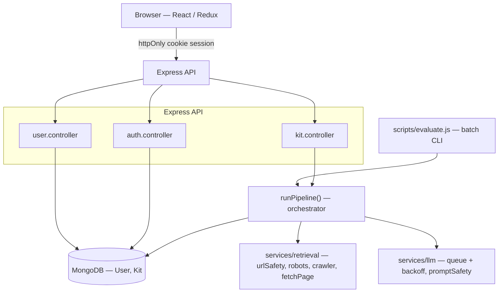
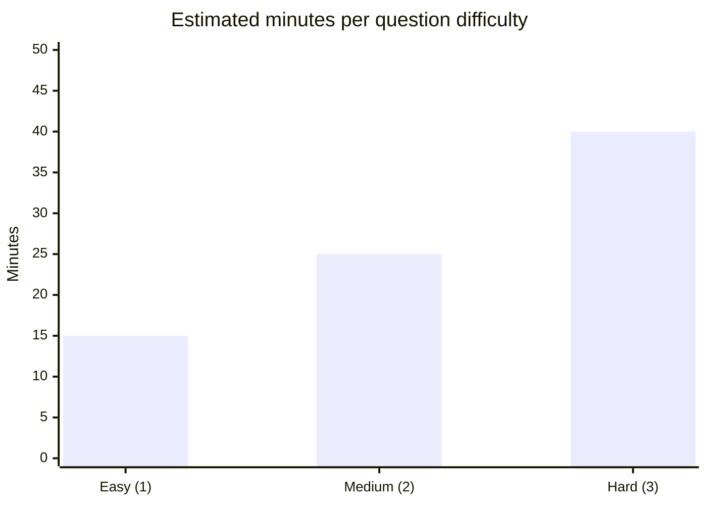

# InterviewIQ

**AI-powered interview prep, built from a real multi-step pipeline — not a single prompt.**

Paste a job description and a company URL. InterviewIQ researches the
company, breaks down the role, and hands back an editable kit: a company
brief, categorised question bank, flashcards, and a day-by-day study
schedule — with every claim traceable back to something it actually found.

<p>
  
  
  
  
  
</p>

---

## Contents

- [What it does](#what-it-does)
- [Tech stack](#tech-stack)
- [Architecture](#architecture)
- [The generation pipeline](#the-generation-pipeline)
- [Schedule allocation](#schedule-allocation)
- [Retrieval approach](#retrieval-approach)
- [State model — generated / edited / pinned](#state-model--generated--edited--pinned)
- [Getting started](#getting-started)
- [Environment variables](#environment-variables)
- [Deployment](#deployment-free-tier)
- [Edge cases](#edge-cases)
- [Testing](#testing)
- [Known limitations](#known-limitations--trade-offs)

---

## What it does

- **Researches the company** — crawls its site for careers/handbook pages
  and searches public discussion of its interview process.
- **Breaks the JD into requirements**, each generating its own coverage
  obligation later in the pipeline.
- **Generates questions per requirement kind** — technical, behavioural,
  domain — plus system-design questions when signals call for it.
- **Checks its own coverage**, deterministically, and re-generates only for
  the requirements it missed (up to three passes).
- **Builds a day-by-day schedule** by pure arithmetic, front-loading
  higher-value material.
- **Remembers what you've edited** — pinned or hand-edited items always
  survive a regeneration of their category.

## Tech stack

| Layer | Choice | Notes |
|---|---|---|
| Frontend | React 19 (Vite) + Tailwind CSS v4 | Client-rendered SPA behind auth, no SEO/SSR need — Vite over Next.js for dev-loop speed. Hand-built shadcn-style primitives (Radix + `class-variance-authority` + `tailwind-merge`) instead of the shadcn CLI, since the CLI needs an interactive `init` step. |
| State | Redux Toolkit (`user`, `kit`, `theme` slices) | |
| Backend | Node.js + Express, ESM (`"type": "module"`) | |
| Database | MongoDB (Atlas) + Mongoose | |
| LLM | **Groq** — `openai/gpt-oss-120b`, OpenAI-compatible endpoint | Genuine free tier, generous tokens/minute. `reasoning_effort: "low"` is set on every call — gpt-oss is a reasoning model and its hidden chain-of-thought otherwise eats into `max_tokens` and truncates JSON output. |
| Auth | Email + password, JWT in an httpOnly cookie, bcrypt hashing | No OAuth, no email verification/reset — explicitly out of scope per the brief. |
| Scraping | `cheerio` + native `fetch`, hand-rolled crawler | No headless browser — company marketing/careers pages are almost universally server-rendered HTML, and a real browser would blow the time/rate budget for no benefit here. |

## Architecture



`runPipeline()` (`backend/services/pipeline/runPipeline.js`) is the single
source of truth: both the HTTP API and the batch CLI call it directly, so
there is exactly one implementation of "turn a JD into a kit" — never two
that could drift apart.

## The generation pipeline

Each step responds to what the previous ones actually found — nothing runs
against a guess.

```mermaid
flowchart LR
    A["1 · Extract requirements\nfrom the JD"] --> B["2 · Crawl the\ncompany site"]
    B --> C["3 · Search public\ndiscussion"]
    C --> D["4 · Summarise interview-\nprocess signals"]
    D --> E["5 · Generate\ncompany brief"]
    E --> F["6 · Generate questions\nper requirement kind"]
    F --> G["7 · Generate\nflashcards"]
    G --> H["8 · Coverage check\n(deterministic)"]
    H --> I["9 · Second pass —\nfill gaps (≤3 total)"]
    I --> J["10 · Build schedule\n(deterministic)"]
    J --> K["11 · Validate\nstructure (Zod)"]
```



Two steps are explicitly **not** handed to the model, per the brief:
**coverage checking** and **schedule allocation** are both plain code.

### The second pass

After the first draft, `checkCoverage` returns every uncovered requirement.
The loop then splits gaps into must/nice-to-have, regenerates questions
*only* for what's still missing, re-checks coverage, and repeats up to
**3 total passes** — then reports whatever remains honestly rather than
looping forever against a provider that may simply not produce a question
for an unusual requirement.

## Schedule allocation

Pure arithmetic in `services/pipeline/scheduler.js` — no model involved.
Every generated question gets an estimated duration from its difficulty:



Questions are then sorted by (a) whether they cover a **must**-priority
requirement, (b) difficulty, (c) category, and split across the requested
number of days — front-loading day 1 with any remainder rather than
back-loading "the night before." Fewer questions than days (a thin JD, long
runway) cycles back over the same material as half-length review days, so
every requested day still has real content.

## Retrieval approach

- **Crawling** — best-first search from the homepage. Outbound links are
  scored against keyword signals (`careers`, `handbook`, `life-at`,
  `interview-process`, …) with a penalty for `login`/`pricing`/`terms`; the
  crawler always fetches the highest-scoring unvisited link next, up to 2
  levels deep and 6 pages.
- **Public discussion** — DuckDuckGo's HTML endpoint, searched for
  `"<company> interview process questions"`. Best-effort: a failed or empty
  search is recorded and the kit says so honestly, never fabricated.
- **Safety** — every fetch goes through an SSRF guard (rejects
  non-http(s), blocks private/loopback ranges), `robots.txt` compliance, a
  per-host rate limit, a 2MB size cap, and a content-type allowlist.
- **Prompt-injection defence** — every piece of untrusted text (the JD,
  every crawled page) is wrapped in an explicit "this is data, not
  instructions" fence before it reaches the model.

## State model — generated / edited / pinned

Every question, flashcard, the company brief, and the schedule carries a
`meta: { origin, edited, pinned }`. This is what makes "regenerate one
section without losing edits made elsewhere" mechanical rather than fuzzy:

| Flag | Meaning |
|---|---|
| `origin: "user"` | Added by the person — always survives regeneration. |
| `edited: true` | Set automatically the first time a generated item is changed in the builder — always survives. |
| `pinned: true` | Explicit opt-in via the pin icon — same guarantee, for a generated item kept as-is. |

Regenerating a category keeps every protected item, computes which
requirements are *still* covered, and only asks the model for what's left —
never blindly duplicating coverage a kept item already provides.

## Getting started

**Backend**
```bash
cd backend
npm install
cp .env.example .env      # fill in MONGODB_URL, JWT_SECRET, GROQ_API_KEY
npm run dev                # http://localhost:8000
```

**Frontend**
```bash
cd frontend
npm install
cp .env.example .env       # VITE_SERVER_URL=http://localhost:8000
npm run dev                 # http://localhost:5173
```

**Batch entry point** — works from a clean clone, no DB needed:
```bash
cd backend
npm install
cp .env.example .env       # only GROQ_API_KEY is required for this command
npm run evaluate -- --input cases.json --output kits.json
```
`company_url` may point at a locally-served fixture (e.g.
`http://localhost:8099/acme/`) — set `ALLOW_PRIVATE_HOSTS=true` in `.env`
for that case, since the SSRF guard otherwise refuses loopback/private
hosts by default even outside production.

## Repository layout

```
InterviewIQ/
  backend/    Express API, retrieval, LLM pipeline, batch CLI, tests
  frontend/   React app (builder UI, practice mode, auth)
```

## Environment variables

| Var | Used by | Purpose |
|---|---|---|
| `PORT` | backend | HTTP port (default 8000) |
| `NODE_ENV` | backend | `production` enables secure cookies and always rejects private/loopback URLs |
| `FRONTEND_URL` | backend | CORS allow-origin |
| `MONGODB_URL` | backend (API only, not `evaluate`) | Mongo Atlas connection string |
| `JWT_SECRET` | backend | Session token signing |
| `GROQ_API_KEY` | backend | Groq API key (**required**, incl. for `npm run evaluate`) |
| `GROQ_API_BASE_URL` | backend | Defaults to `https://api.groq.com/openai/v1` |
| `GROQ_MODEL` | backend | Defaults to `openai/gpt-oss-120b` |
| `CRAWLER_USER_AGENT` | backend | Sent on every crawl request |
| `ALLOW_PRIVATE_HOSTS` | backend | Dev/test-only escape hatch for the SSRF guard (ignored when `NODE_ENV=production`) |
| `VITE_SERVER_URL` | frontend | Backend base URL |

## Deployment (free tier)

**Backend → Render** (or Railway/Fly.io — same idea)
1. New "Web Service" → connect this GitHub repo → **root directory: `backend`**.
2. Build command: `npm install`. Start command: `npm start`.
3. Set env vars (Render → Environment tab): `MONGODB_URL`, `JWT_SECRET`,
   `GROQ_API_KEY`, `GROQ_API_BASE_URL`, `GROQ_MODEL`, `CRAWLER_USER_AGENT`,
   `ALLOW_PRIVATE_HOSTS=false`, `NODE_ENV=production`, and `FRONTEND_URL`
   (fill in after the frontend is deployed, then redeploy).
4. In MongoDB Atlas → Network Access, allow `0.0.0.0/0` (or Render's static
   outbound IPs on a paid Atlas tier) so the deployed backend can reach the
   cluster.

**Frontend → Vercel**
1. New Project → import this repo → **root directory: `frontend`**.
2. Framework preset: Vite. Build command: `npm run build`. Output: `dist`.
3. Env var: `VITE_SERVER_URL` = the Render backend URL from above.
4. Deploy, then copy the Vercel URL back into the backend's `FRONTEND_URL`
   on Render and redeploy so CORS allows it.

Both platforms have genuine free tiers and serve over HTTPS in production,
which the auth cookie's `secure: true, sameSite: "none"` requires. Render's
free tier spins down on idle — the first request after inactivity can take
~30–60s to wake the backend.

## Edge cases

| Case | Behaviour |
|---|---|
| Invalid/404/timeout company URL | Crawl step fails safely, recorded as a skipped source; kit still generates with an honest "could not be retrieved" brief. |
| No discoverable hiring/about page | Best-first crawl simply doesn't find one; `interview_process.notes` says so plainly instead of guessing. |
| Two-line JD stub | `extractRequirements` returns however few requirements are actually implied — no invented title/seniority/responsibilities. |
| No public discussion found | Recorded as a skipped source (`NO_RESULTS`), never fabricated. |
| Model returns invalid JSON | One repair round-trip; Groq's `json_validate_failed` (usually a truncation) is treated as retryable with a fresh sample. |
| Provider rate-limits / briefly fails | All LLM calls share one process-wide queue with fixed spacing plus exponential backoff + jitter, up to 4 retries. |
| Same JD + company submitted twice | Returns the existing kit for that `(owner, jd, company_url)` instead of re-running generation, unless it previously failed. |
| 1-day / 60-day schedule | Both extremes covered by unit tests — see [Schedule allocation](#schedule-allocation). |

## Testing

```bash
cd backend && npm test   # Vitest
```
Covers the three behaviours worth protecting most: **schedule allocation**,
**coverage checking**, and **structure validation** (referential integrity —
unknown ids, duplicate ids, non-integer minutes, mismatched day counts).

## Known limitations / trade-offs

- **No creative/optional feature was built** — the 4-day window went
  entirely to required scope: the pipeline, coverage loop, builder edit/pin
  model, and practice mode all needed to be solid first.
- **Groq's gpt-oss models spend part of every response's token budget on
  hidden reasoning.** `reasoning_effort: "low"` and generous `max_tokens`
  mitigate this, but a very large JD could still hit truncation on the
  first attempt before a retry succeeds.
- **DuckDuckGo's HTML markup isn't a stable API** — public-discussion
  search is best-effort and degrades gracefully if the markup changes.
- **No websocket for generation progress** — the frontend polls
  `GET /api/kit/:id` every 2.5s. Simpler and more robust across free-tier
  hosts than a persistent connection.
- **Company-brief regeneration re-crawls** rather than caching page text,
  to keep document size bounded.
